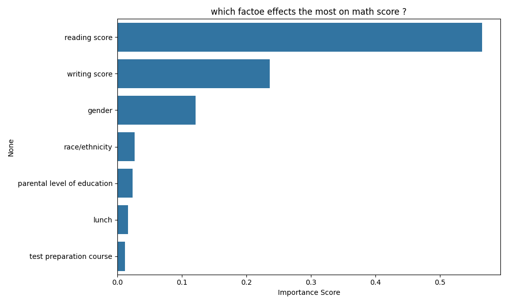

# 🎓 Student Performance Prediction

> A Machine Learning regression model that predicts student math scores based on demographic and academic features — built with Python and Scikit-learn.

[](https://python.org)
[](https://scikit-learn.org)
[]()
[]()
[](https://www.kaggle.com)

---

##  Project Overview

This project builds an end-to-end ML pipeline to predict a student's **math score** using features like gender, parental education level, lunch type, test preparation course, and reading/writing scores. Trained on a Kaggle dataset of **1,000 students**.

--

##  Results

| Metric | Value |
|---|---|
| **R² Score** | **0.85** (84.9% variance explained) |
| **Mean Absolute Error** | **4.70 marks** |
| **Strongest Predictor** | Reading Score |
| **Model** | Random Forest Regressor |

--

## 🔬 What I Did

- Performed **Exploratory Data Analysis (EDA)** — distributions, correlations, outlier checks
- **Encoded categorical features**: gender, parental education, lunch type, test preparation course
- Used **feature importance visualization** to identify key predictors
- Trained and evaluated a **Random Forest Regressor**
- Generated **actual vs predicted** and **feature importance** plots

--

##  Key Finding

> **Reading score** emerged as the strongest single predictor of math performance — stronger than demographic factors like gender or parental education level.

--

## 📁 Repository Structure

```
Student_perfomance_prediction/
│
├── student_performances_prediction.ipynb   # Main notebook (EDA + Model)
├── StudentsPerformance.csv                 # Dataset (Kaggle)
├── actual_vs_predicted.png                 # Model output visualization
├── feature_importance.png                  # Feature importance chart
└── README.md
```

---

## ⚙️ Tech Stack

| Category | Tools |
|---|---|
| Language | Python 3.x |
| ML Library | Scikit-learn |
| Data | Pandas, NumPy |
| Visualization | Matplotlib, Seaborn |
| Environment | Jupyter Notebook |

---

## 🚀 How to Run

```bash
# 1. Clone the repository
git clone https://github.com/nandkishor-ux/Student_perfomance_prediction.git
cd Student_perfomance_prediction

# 2. Install dependencies
pip install pandas numpy scikit-learn matplotlib seaborn jupyter

# 3. Launch the notebook
jupyter notebook student_performances_prediction.ipynb
```

---

## 📈 Visualizations

| Actual vs Predicted | Feature Importance |
|---|---|
|  |  |

---

## 👤 Author

**Nand Kishor Kumar**
- GitHub: [@nandkishor-ux](https://github.com/nandkishor-ux)
- Email: nandkishor0720@gmail.com
-
