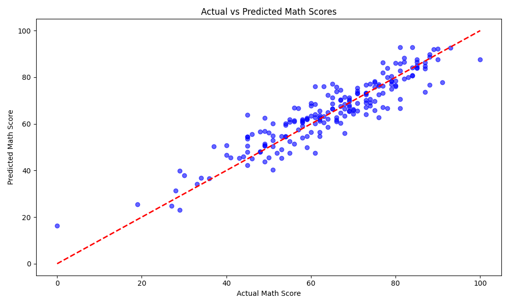

# 🎓 Student Performance Prediction

A machine learning web app built with **Flask** that predicts a student's **Math Score** based on demographic and academic factors.

## 📸 Demo


## 🚀 Features
- Predicts math score based on student profile
- Clean and responsive web UI
- Random Forest Regression model
- Flask backend

## 📊 Dataset
- **Source:** StudentsPerformance.csv
- **Size:** 1000 students
- **Features:** Gender, Race/Ethnicity, Parental Education, Lunch, Test Preparation Course, Reading Score, Writing Score

## 🧠 Model
- **Algorithm:** Random Forest Regressor
- **Target:** Math Score
- **Encoding:** Label Encoding for categorical features

## 🛠️ Tech Stack
- Python
- Flask
- Scikit-learn
- Pandas, NumPy
- Matplotlib, Seaborn
- HTML, CSS

## ⚙️ How to Run Locally

```bash
# 1. Clone the repo
git clone https://github.com/nandkishor-ux/Student_perfomance_prediction.git

# 2. Go to project folder
cd Student_perfomance_prediction

# 3. Install dependencies
pip install flask scikit-learn pandas numpy

# 4. Run the app
python app.py
```

Open browser → http://127.0.0.1:5000

## 📁 Project Structure
